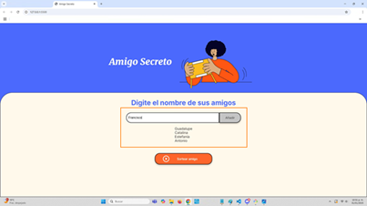
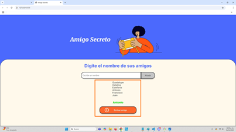
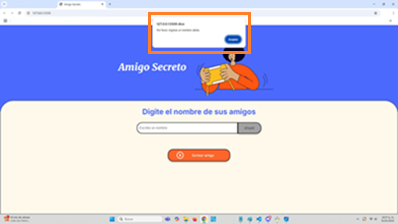

<h1 align = center>Amigo Secreto</h1>

<h2>Descripción</h2>

Aplicación desarrollada como parte del programa <b>ONE Oracle Next Education</b>, iniciativa de <i>Oracle</i> y <i>Alura Latam</i>, con el objetivo de poner en práctica los conceptos fundamentales de la lógica de programación, consiste en un juego interactivo en el que el usuario digita nombres de amigos y obtiene mediante un sorteo el nombre de un amigo.

<h2>Estado del proyecto</h2>

<strong>Versión beta terminada</strong>

¡¡¡Espera próximas actualizaciones porque el ciclo de vida de esta aplicación apenas comienza!!!

<h2>Características</h2>

Esta aplicación tiene como principales características:

- Diseño simple y atractivo :art:
- Interfaz intuitiva y funcional :desktop_computer:
- Capacidad de interacción :busts_in_silhouette:
- Actualizaciones periódicas :floppy_disk:
- Funcionalidades específicas :curly_loop:

<h2>Funcionalidades</h2>

- `Almacenamiento de valores`: Capacidad de almacenar una lista de nombres.
- `Adición de valores`: Capacidad de agregar elementos a la lista de nombres.
- `Actualización de valores`: Capacidad de actualizar la lista de nombres.

  
- `Selección aleatoria de valores`: Capacidad de seleccionar y mostrar de forma aleatoria un elemento de la lista de nombres.

  
- `Impresión de alertas`: Capacidad de mostrar alertas para orientar al usuario durante el juego.

<h2>Tecnologías utilizadas</h2>

Esta aplicación se basa en las tecnologías:

- JavaScript
- HTML
- CSS

<h2>Acceso a la aplicación</h2>

<strong>Usuarios</strong>

Si eres usuario y quieres pasar un momento divertido, da click en el siguiente enlace https://github.com/Ararita-art/challenge-amigo-secreto-, sigue las instrucciones y... ¡¡¡Empieza a jugar!!! :game_die: 

<h3>Instrucciones de uso</h3>

Para disfrutar al máximo este juego, sigue estas instrucciones:

- 1 Da <i>click</i> en el enlace del juego.
- 2 Descarga la carpeta <i>"challenge-amigo-secreto-"</i> en tu repositorio local, para ello utiliza un sistema VCS como Git. 
- 3 Abre la carpeta <i>"challenge-amigo-secreto-"</i> y da doble <i>click</i> en el archivo <i>"index.html"</i>, se abrirá la pantalla del juego en tu navegador.
- 4 Digita el nombre de un amigo en la casilla <i>"Escribe un nombre"</i>.
- 5 Presiona el botón <i>"Añadir"</i>.
- 6 Observa como el nombre que digitas se enlista en la pantalla.
- 7 En caso de que presiones el botón <i>"Añadir"</i> sin digitar el nombre de un amigo, el juego te enviará la alerta: <i>"Por favor, ingrese un nombre válido"</i>, para cerrarla presiona el botón <i>"Aceptar"</i>.
- 8 Digita tantos nombres de amigos como extensa sea la lista de amigos que decidas.
- 9 Presiona el botón <i>"Sortear amigo"</i> para que la aplicación sortee y muestre el nombre del amigo elegido.
- 10 En caso de que presiones el botón <i>"Sortear amigo"</i> sin haber digitado nombres de amigos, el juego te enviará la alerta: <i>"La lista está vacía, para jugar ingrese nombres"</i>, para cerrarla presiona el botón <i>"Aceptar"</i>.
- 11 Observa como el nombre del amigo sorteado aparece destacado en la pantalla.
- 12 Actualiza la página para reiniciar el juego.

<strong>Desarrolladores</strong>

Si eres desarrollador y quieres revisar el proyecto da click en el siguiente enlace https://github.com/Ararita-art/challenge-amigo-secreto- y... ¡¡¡Envía retro del proyecto!!! :calling: 

<h2>Desarrolladora de la aplicación</h2>

Araceli Gámez

<h3>Contacto</h3>

Si como yo, eres un entusiasta aprendiz de programación, contáctate conmigo a través de:

<b>`GITHUB`</b>: https://github.com/Ararita-art

<b>`LINKEDIN`</b>: www.linkedin.com/in/araceli-gámez-chávez-21a135312
